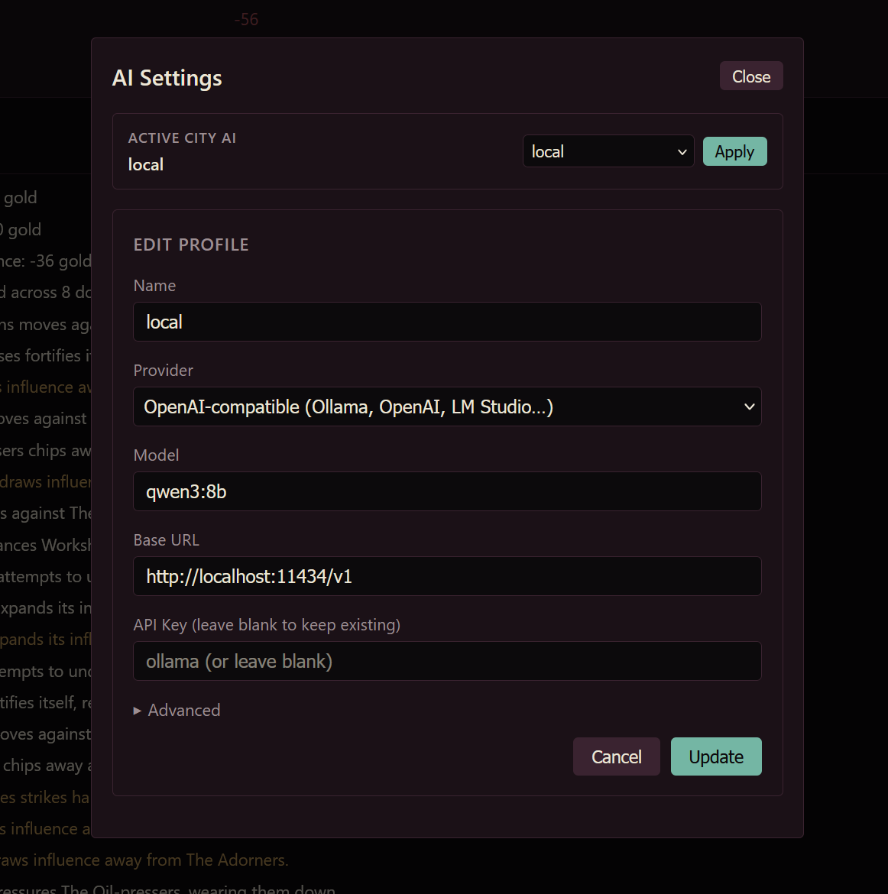

# Getting Started with Polis

This guide covers installation, configuration, and how to run the simulation.

## Prerequisites

- **Python:** 3.13+ required (the engine uses features exclusive to this version).
- **Node.js:** 20+ (only needed if you want to build/run the browser UI).
- **(Optional) API Keys:** If you want live LLM negotiations. The game runs fully offline with the built-in stub.
- **The Polis repository** on your machine, with a terminal open in its root.

## Installation

1.  **Install Backend Dependencies:**
    From the repository root:
    ```bash
    pip install -r requirements.txt
    ```

2.  **Build the Frontend:**
    The server serves the *built* UI, so this step is required (not just `npm install`).
    ```bash
    cd frontend
    npm install
    npm run build
    cd ..
    ```
3. **Start the Server:** (Use this to start the game every time)
    ```bash
    cd backend
    py -m uvicorn api.server:app --reload
    ```
4. **Play in browser:**
    Open **http://localhost:8000**
    Click **New Game**
    Name yourself and your city, and **Start**.

## Configuring the Live LLMs

Live faction audiences need an AI to voice the leaders. Configure one in-game under **Settings → AI Settings**.



1. **Open Settings.** In game, click **Settings** to open the **AI Settings** panel.
2. **Fill out a profile** under **Edit Profile**:
    - **Name** — any label you'll recognize (e.g. `local`).
    - **Provider** — choose your provider (e.g. *OpenAI-compatible (Ollama, OpenAI, LM Studio…)* or *Anthropic*).
    - **Model** — the model id (e.g. `qwen3:8b`).
    - **Base URL** — the endpoint, for OpenAI-compatible/local servers (e.g. `http://localhost:11434/v1` for Ollama).
    - **API Key** — your key; for local servers a placeholder or blank is usually fine. Leave blank to keep an existing saved key.
3. **Save** the profile with **Update**.
4. **Test the connection** (recommended). Use the **Test** control to confirm the profile reaches the model before you rely on it in play.
5. **Activate it.** Under **Active City AI**, pick your profile from the dropdown and click **Apply**. The chosen name shows as the active AI.

> An audience won't start until an active AI is set. If the **Request Audience** or **Audience** buttons warn you, return here and **Apply** a profile.

## Next Steps

* 🎮 **[How to Play](./HOW_TO_PLAY.md)** — Learn the rules of negotiation, faction dynamics, and the cycle loop.

> **Quick smoke test (no UI):** From the repo, run `cd backend && py main.py --cycles 5` to run the engine for 5 cycles and print the result. Useful for confirming the install works before building the frontend.