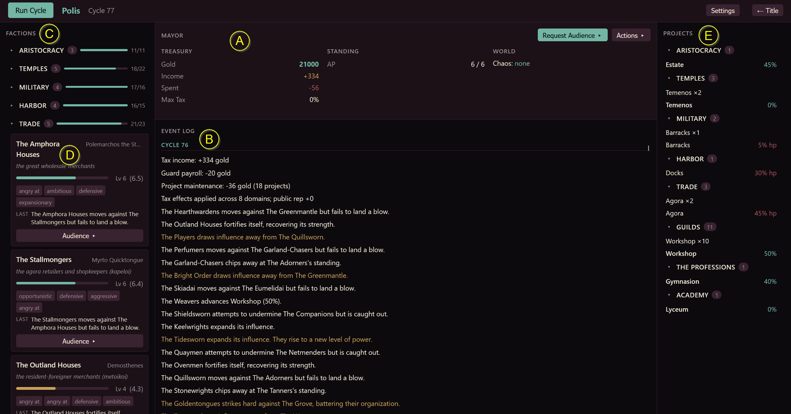

# How to Play Polis

You are the **Mayor** of a Greek city-state — historically the *Prytanis*, the presiding official. You hold the chair, but not the whip. The city's power belongs to its factions: noble houses, priesthoods, generals, merchant guilds, orators. You cannot command them. You can only **negotiate, pressure, and invest** — and live with what the city does in response.

This guide teaches you to sit down and play. It covers what's on screen, how a turn works, what the factions are doing, the levers you hold, and the one feature that makes Polis different: **live negotiation that becomes binding rules**.

> New here? Read top to bottom once, then jump to [Your First Five Cycles](#your-first-five-cycles) and start playing.

---

## The Idea in One Minute

The city runs itself. Each **cycle** (a turn), every faction takes one action — growing stronger, defending itself, helping an ally, or moving against a rival. They act one at a time in a random order, reacting to what just happened. Out of dozens of these small moves, a story emerges: a guild rises, a priesthood overreaches, a general's house fractures.

You don't get a move in that scrum. Instead you work *around* it — meeting leaders, endorsing or condemning them, funding city projects, and above all holding **audiences** where you bargain face to face. When a leader agrees to something, their words become a **deal** the engine actually enforces. Honor it or break it; either way, it sticks.

Your job is to stay in the chair. Keep the public on side, keep the treasury solvent, and keep enough factions content that no coalition forms to remove you.

---

## Your Screen

The game view has five regions, marked **A–E** on the screenshot above:

- **A — Mayor panel (center top).** Your dashboard. **Treasury** (gold, income, and spending this cycle), your **Standing** — shown as `6 / 6`, your **Action Points** out of the maximum — and the **World** state (Chaos). The two buttons here, **Request Audience** and **Actions**, are how you act.
- **B — Event Log (center).** The story so far. After each cycle this fills with what every faction did — who grew, who struck whom, who rose to a new level. Highlighted lines are the dramatic beats worth reading closely.
- **C — Factions list (left).** The eight **domains** of city life, each with the factions that contend in it. The small number is how many factions are in that domain; the bar shows how "full" the domain is — how much room remains for anyone to keep growing.
- **D — Faction card (left, expanded).** Click a faction to open it: its leader, a one-line description, its **level and rating** (e.g. `Lv 6 (6.5)`), its **personality traits**, what it did **last**, and an **Audience** button to negotiate with it directly.
- **E — Projects panel (right).** The city's buildable infrastructure — estates, temples, barracks, docks — grouped by domain, each showing build progress or structural condition.

Top-left, the **Run Cycle** button advances time. Top-right, **Settings** (where you choose the AI that voices faction leaders) and **Title** (back to the menu).

---

## How a Cycle Works

Press **Run Cycle** and the city takes a turn:

1. **The treasury settles** — taxes come in, upkeep on your projects goes out.
2. **Initiative is rolled** — the factions are shuffled into a fresh random order.
3. **Factions act, one at a time** — each takes a single action. Because the order is sequential, a faction late in the order sees and reacts to what earlier ones just did. This is where cascades happen: one fall opens a gap, and the next faction pounces.
4. **The dust settles** — traits shift, projects tick, and any faction reduced to nothing is dealt with (see [Breaks](#breaks-no-one-dies)).

Everything that happened is written to the **Event Log** for you to read. Then it's your move again.

**Your turn never expires.** Between cycles, take as many actions as your Action Points allow, hold an audience, read the log, plan. The city only moves when *you* press Run Cycle. There's no clock.

---

## What the Factions Are Doing

Read the Event Log and you'll see the same handful of verbs. Each faction takes exactly **one** of these per cycle, chosen by its personality and circumstances:

| Action | What it means |
|---|---|
| **Grow** | Invests in itself and gains rating. Climbing past a whole number is a **level-up** — a dramatic beat. |
| **Protect** | Shores itself up, recovering strength after taking hits. |
| **Aid** | Helps an ally recover — alliances can even cross domains. |
| **Harm** | Moves against a rival **in its own domain**, trying to wound it. Contested — it can land hard, glance off, or fail outright. |
| **Steal** | Siphons standing from a rival in its domain, growing at their expense. Also contested. |

Factions also **build** and **sabotage** the city's projects. Two things shape all of this:

- **Level & rating.** A faction's rating (1.0–10.0) is its clout; the whole-number part is its **level**. Higher-level factions roll better in conflicts and matter more in their domain.
- **Health.** A buffer, not a life bar. Harm chips it down; Protect and Aid restore it. Hit zero and the faction **Breaks** — it doesn't die.

### Breaks: no one dies

Polis has **no permanent losers**. When a faction's health hits zero it suffers a **Break** — usually it drops a level and picks itself back up; occasionally its leader falls and a successor emerges. Either way the faction survives and keeps playing. The board never empties, so the politics never stop.

### Domains fill up

Each domain has a **ceiling** on how much total clout it can hold (the bar in the Factions list). When a domain is full, factions inside it can't simply grow — they have to take from each other, or wait for the ceiling to rise. **Building projects raises the ceiling**, which is one quiet way you can shape who thrives.

---

## Your Levers

You act by spending **Action Points** (your Standing, top-center). You start with a few, gain **+1 each cycle**, and cap out — so bank a couple, but don't hoard. Some actions also cost **gold**.

Click **Actions** for the menu. Your tools:

| Lever | Cost | What it does |
|---|---|---|
| **Publicly Endorse** | 1 AP | Boosts one faction's regard for you — but annoys its rivals in the same domain. |
| **Publicly Condemn** | 1 AP | Damages a faction's regard for you, while its rivals quietly approve. |
| **Sabotage** | 1 AP + gold | Covertly sets a faction back — bounded, and they'll know it was you. |
| **Build Project** | 1 AP + gold | Start, advance, or repair a city project in any domain. Raises that domain's ceiling. |
| **Request an Audience** | 1 AP | Sit down and negotiate. The headline feature — see below. |
| **Break a Deal** | free | Walk away from an active deal. Costs you reputation, not Action Points. |

Everything you do moves **reputation** — with each faction, and with **The Public**. Reputation drifts back toward neutral when you leave it alone, so relationships need tending. Let too many factions turn hostile, or the Public sour on you, and the removal spiral begins (see [Staying in the Chair](#staying-in-the-chair)).

> **A note on favoritism.** Almost every favor has a cost somewhere else. Endorse a house and its rivals bristle; favor one faction and the rest of its domain grumbles. There is no move that pleases everyone — that tension *is* the game.

---

## Audiences: Words That Become Rules

This is what makes Polis different. An **audience** is a real negotiation with a faction leader, voiced by an AI in character. Whatever you settle on becomes a **binding deal** the engine enforces.

Open one from **Request Audience** (center) or a faction card's **Audience** button. It runs as a short scene:

1. **The leader opens** — in character, setting their mood and position.
2. **You speak** — freeform. Make an offer, ask a question, probe.
3. **The leader responds** — pushing back, naming a price, or warming up.
4. **You speak once more** — your final word.
5. **The leader decides** — they accept or decline, and if they accept, they state the terms.

**Nothing binds until you confirm.** Even when a leader agrees, the deal isn't sealed until *you* click Accept. The leader's enthusiasm doesn't write the contract — you do.

**What can be in a deal:**

- **You can offer:** an endorsement (an immediate boost to your standing with them).
- **They can commit to:** growing their strength, protecting themselves, building a specific city project, or refraining from attacking a named rival — held to it, every cycle, for the agreed term.

Once sealed, a deal **runs and is enforced**. The faction does what it promised; you provide what you offered. If the faction can't carry out its promise some cycle (no valid target, say), the deal politely pauses rather than breaking.

**Breaking faith has weight.** You can **Break a Deal** anytime, for free — but the faction turns angry, the Public notes it, and rivals hear about it. Likewise, a faction that abandons its commitment damages your relationship. Deals matter precisely because they can be broken.

> **You need an AI configured to hold audiences.** Set one in **Settings → Active city AI**. Without it, the audience buttons prompt you to choose one first. See [Getting Started](GETTING_STARTED.md) for provider setup.

---

## Staying in the Chair

Polis is about *lasting*. You're removed when the city turns against you — and it's a **spiral**, not a guillotine: decline feeds decline, but you can pull out if you act early.

What pushes you toward removal:

- **The Public souring on you** — let public reputation fall far enough and a countdown begins.
- **A hostile coalition** — several factions turning hostile at once piles pressure on, dragging the Public down with them.
- **Bankruptcy** — let the treasury sit in the red and the city loses faith fast.

None of these is instant. Each gives you cycles to recover — mend a relationship, reverse a policy, stabilize the gold. The skill is reading the warning signs in the Event Log and your reputation before the spiral gathers speed.

> Polis is in **playable alpha** — some end-game systems (victory conditions, population and food, full project content) are still being built. The political core above is complete and runs end to end.

---

## Your First Five Cycles

A gentle on-ramp:

1. **Look before you leap.** Read the Event Log and skim the Factions list. Who's strong? Who's fighting whom? Which domains are crowded?
2. **Make a friend.** Pick a faction you'd like on side and **Meet** with them, or **Endorse** them — but glance at their domain rivals first, since they'll feel the snub.
3. **Hold an audience.** (Configure an AI in Settings first.) Sit down with a leader, hear them out, and try for a modest deal — your endorsement in exchange for them building a project, say. Confirm only if the terms suit you.
4. **Run a few cycles.** Press **Run Cycle** and watch the city move. Read what your deal partner actually does. Notice how reputation drifts when you're hands-off.
5. **Adjust.** Reinforce what's working, mend what's fraying. You're not steering the city — you're nudging it, one relationship at a time.

That's the loop: read the city, make your moves, run the cycle, live with the consequences. The depth comes from how those small nudges compound.

---

**Ready?** Press **Run Cycle** and see what your city does. → Back to [Getting Started](GETTING_STARTED.md)
