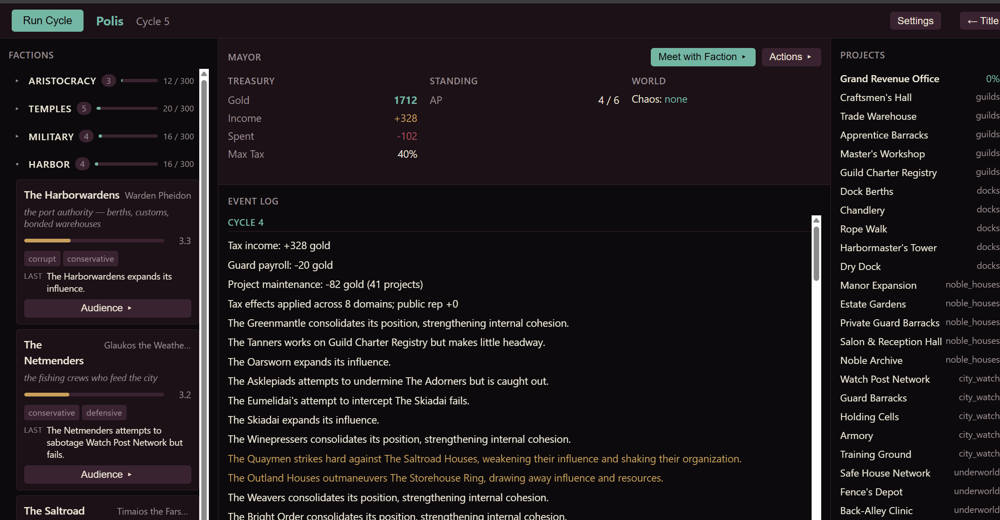

# Polis — Govern the Ungovernable

> Rival factions scheme on their own inside an ancient-Greek city-state. You bargain with their
> leaders through a **live LLM** — and whatever you agree becomes binding game state the faction
> will hold you to, or remember you breaking.

<!-- TODO: a 10s GIF of audience → deal struck → faction acting on it next cycle would beat both stills. -->


**Polis** models the struggle for influence inside a single Greek *polis*. Eight spheres of
influence — Aristocracy, Temples, the Harbor, the Academy and more — are contested by **41
factions** (noble houses, priesthoods, merchant and banking houses, guilds, generals, orators),
each with an embedded leader and a personality that drives its choices. Factions act one at a
time each cycle and react to each other *within* it, so the story is emergent: alliances,
collapses, power vacuums, and the slow tilt toward greatness or tyranny that no rule scripts.

You play the **Prytanis** — the city's presiding official (the `Mayor` role in the engine). You
can't command the factions; you *work* them — endorse and condemn, levy taxes, broker deals,
spend coin and favor. And you can hold live **negotiation audiences** with any leader: they argue
in character from their faction's identity, you make your case across two exchanges, and the
terms you settle on are parsed into a structured **deal** that the simulation then enforces —
which either side can honor or break, at a reputation cost.

**Status:** playable alpha — the core loop (sim, treasury, mayor actions, LLM audiences, deals)
works end to end. See [Limitations & what's next](#limitations--whats-next) for the honest gaps.

---

## Why it's interesting

- **An LLM whose words become rules.** Audiences aren't flavor text. The leader's agreed terms are
  parsed and validated into live deals — a committed action, a tax exemption, a duration — that
  the engine applies and checks every cycle, and the faction's memory of the meeting persists.
- **Emergent, not scripted.** Outcomes come from faction traits, contest math, and sequential
  initiative — not hand-authored event chains. Run it twice with the same seed and it's identical;
  change one trait and the run diverges.
- **A pure rules engine at the core.** `engine/` is deterministic simulation logic that imports
  *only the standard library* — no framework, no I/O. The API, DB, and UI wrap it; they don't
  reach into it. That's why the whole suite runs in ~1 second.
- **Every acceptance criterion is test-backed.** 268 committed tests, each tracing to a written
  *Done-when* in a spec — contest math, cycle order, events, mayor actions, and the LLM
  deal-parser are all pinned, not just spot-checked.


---

## Design notes

The decisions that took judgment, not boilerplate:

- **The LLM is treated as an untrusted source.** A faction leader can say anything; the engine
  trusts none of it. The response parser extracts the `<deal>` block, validates each term against
  what's mechanically possible (known action types, faction/project ids, durations clamped to
  range), silently drops the invalid, and rejects one-sided "deals" where a side committed
  nothing. A malformed or empty block degrades to "no deal" — never a crash, never an illegal
  state mutation. The model proposes; the rules engine disposes.

- **A confirmation gate between dialogue and consequence.** A leader *accepting* doesn't create a
  deal — the Prytanis must then confirm. This keeps a probabilistic model from unilaterally
  writing durable state, and makes the human the commit point.

- **Sequential initiative for genuine emergence.** Each cycle factions are shuffled and act one at
  a time, reading the state left by whoever moved before them — so a faction can react to a rival's
  move inside the same cycle. The drama (cascades, power vacuums, collapses) falls out of ordering
  and contest math, not a script.

- **Bounded, summarized memory.** Each faction remembers its history with the Prytanis, but memory
  is capped: at the 9th note the oldest five are compressed (by the LLM, or a stub) into one
  summary row. Context stays rich without growing unbounded across a long run.

- **Provider-agnostic LLM layer with an offline stub.** A three-layer split (engine↔prompt
  translation / client / provider) lets the same audience run against Anthropic, any
  OpenAI-compatible endpoint (Ollama, LM Studio), or a deterministic stub. With no key configured
  the stub returns valid canned deals, so the full game — and the whole test suite — runs with
  zero external dependencies.

- **Saves are engine snapshots, not ORM rows.** State serializes to a self-contained JSON
  snapshot per cycle; loading rehydrates the pure engine objects. Forward-only column migrations
  keep older saves loadable as the schema grows.

---

## Quick start

**Requirements:** Python 3.13+, and Node.js 18+ (only to rebuild the frontend).

```bash
pip install -r requirements.txt
```

**Run it headless** (no setup, no UI — the fastest way to watch the sim move):
```bash
cd backend
py main.py --cycles 50            # run 50 cycles, print a summary
py main.py --cycles 100 --seed 42 # reproducible run
```
Narrative and system logs land in `backend/logs/`.

**Run the full app** (API + browser UI). The backend serves the UI from `frontend/dist/`, which
is build output and not checked in — so build it once:
```bash
cd frontend && npm install && npm run build
cd ../backend && py -m uvicorn api.server:app --reload
```
Open **http://localhost:8000**, click **New Game**, name yourself and your city, and **Start**.
Run cycles and watch the standings, events, and treasury move; click a faction to hold an audience.
(A city builder for custom domains/factions lives under the same UI.)

**Run the tests:**
```bash
cd backend && py -m pytest tests/ -q
```

---

## Live LLM audiences (optional)

The game runs with **zero external dependencies** — with no provider configured it falls back to a
**stub client** that returns valid canned negotiations. To enable real audiences, copy
`.env.example` to `.env` (or export the variables) and set a provider:

| Variable | Purpose | Default |
|----------|---------|---------|
| `POLIS_SECRET` | JWT signing secret — **set this in any real deployment** | `dev-secret-change-me` |
| `LLM_PROVIDER` | `anthropic`, `openai_compat`, or `stub` | `stub` |
| `LLM_API_KEY` | API key for the chosen provider | — |
| `LLM_MODEL` | Model name | — |
| `LLM_BASE_URL` | Base URL for `openai_compat` (Ollama, LM Studio, …) | — |

Provider SDKs (`anthropic`, `openai`) are optional and imported only when used.

---

## How a cycle runs

| Step | What happens |
|------|--------------|
| 0 | **Treasury** — income, expenditure, debt, tax effects |
| 1 | **Initiative** — factions shuffled into a random turn order |
| 2 | **Action loop** — factions act one at a time (grow, harm, protect, steal, block, build/sabotage projects); state updates between turns |
| 3 | **Project ticks** — construction, completion, defense reset |
| 4 | **End of cycle** — trait drift, chaos, faction collapse, power-vacuum cascades, cooldowns |

`engine/` imports only the standard library and itself; `api/` wraps it in HTTP, `db/` persists
snapshots, and `frontend/` talks to the API over HTTP only.

---

## Tech stack

| Layer | Technology |
|-------|-----------|
| Simulation engine | Python 3.13 (pure, no framework) |
| API | FastAPI + Uvicorn |
| Auth | JWT (`python-jose`) + bcrypt |
| Database | SQLite via SQLAlchemy |
| Frontend | Vue 3 (Options API) + Vite |
| Tests | pytest |

---

## Development workflow (AI-assisted)

Polis is built with **my own [Plumbline](https://github.com/BytesFromToby/Plumbline)** — a
structured, spec-driven workflow for AI-assisted coding that I designed to replace ad-hoc prompting
with a disciplined pipeline:

- **Specs are the source of truth** (`Planning/specs/`), each carrying inline *Done-when* criteria
  tagged `[automated]` or `[human-required]`.
- **Reference docs** (`Planning/reference/`) hold shared truth — data model, contest formulas,
  world theming — verified against the code, so specs cite rather than redefine.
- **Decision records** (`Planning/decisions/`) capture non-obvious choices and why.
- The pipeline runs **spec → blueprint → build → inspect**, with every automated *Done-when* item
  backed by a committed test and signed off against the running software.

The point isn't that AI wrote the code — it's that the intent behind each piece is written down and
the behavior is verified, so the result is auditable rather than just generated.

---

## Limitations & what's next

Honest gaps in the current alpha:

- **No end-game yet.** The city can't (yet) remove the Prytanis — no bankruptcy, coalition, or
  revolt loss condition. Survival + achievements are the intended frame; they're not built.
- **The audience prompt isn't cached.** The system prompt is resent across an audience's three
  calls — fine on the stub, but cost grows with run length under a paid provider. Prompt caching
  is the planned fix.
- **One hand-authored city.** Polis ships as a single curated city; a procedural city generator is
  specced but not built.
- **Content polish.** A few project names/ids still carry pre-theme placeholders.

---

## Repository layout

```
backend/      Python backend
  engine/     Pure simulation logic (models, formulas, cycle, npc, events, mayor, llm)
  api/        FastAPI routes, JWT auth, request/response schemas
  db/         SQLAlchemy models, session, startup seeding
  data/       JSON seed data (domains, factions, projects, world state)
  tests/      pytest suite
frontend/     Vue 3 + Vite browser UI
Planning/     Specs, reference (incl. architecture), proposals, decisions (the Plumbline tier)
docs/         Design system + in-play screenshots
```

---

## License

MIT — see [LICENSE](LICENSE).
