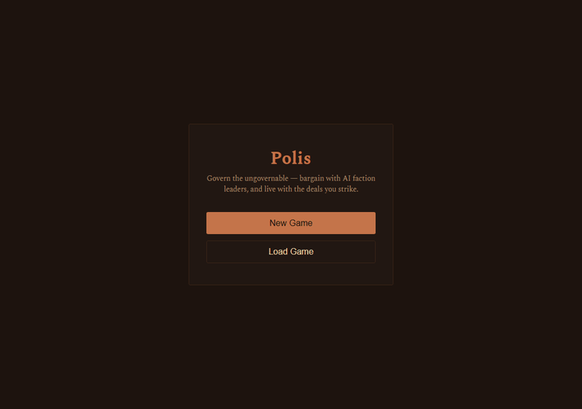

# Polis — Govern the Ungovernable

> A pure rules engine wrapped in a living conversation. Watch a Greek city rise or fall on the deals you strike.

**Polis** simulates power struggles inside an ancient Greek city-state. Seven domains of influence are contested by **28 factions** (noble estates, priesthoods, port traders, craft guilds, the city watch and fleet), each with embedded leadership and personality-driven behavior. You play the **Mayor** — historically the *Prytanis*, the city's presiding official, who cannot command, only negotiate. And below the factions sits **the Public** — a living populace that eats, believes, drinks, and decides whether it trusts you.

**The innovation:** Faction leaders bargain through live LLM audiences. The terms you settle aren't flavor text — they parse into structured `<deal>` blocks that the deterministic simulation engine enforces. Honored, broken, or ignored — consequences persist across cycles.

## Current Status: Playable Alpha 🧪 — `v0.3.2 "Stakes"`

**The full play arc now runs end-to-end — a reign can be won or lost.** The simulation engine, treasury logic, mayor actions, live LLM negotiation audiences, structured deal enforcement, the full Public model, and the complete endgame all run and are tested.

- ✅ **Proven Mechanics:** 638 committed backend tests (plus a frontend harness) cover contest math, cycle order, events, the LLM deal-parser, the Public/resource layer, the endgame, and the difficulty system.
- ✅ **A Living Public (`v0.3.0`):** the populace is a real actor with **seven scales** — *fed, happy, health, piety, unrest, consumption, confidence* — each with its own drivers, word bands, and consequences. It eats from a redundant **food economy** (three sources: grain, fish, flocks), believes (temples produce *piety*; impiety amplifies the blame it heaps on you), drinks (a U-shaped *consumption* axis — both abstinence and excess bite), simmers (*unrest* aggregates pressure with memory; the City Guard suppresses the symptom, not the cause), and trusts or turns on you (*confidence*, which emboldens or restrains the factions).
- ✅ **An Endgame With Both Poles:** a reign can **end** four ways — a removal spiral (lost public support or crushing debt), **population collapse**, being **voted out** at a recurring election, or **assassination** by a conspiracy of the great houses — and can be **won** by climbing the **title ladder** (Prytanis → Archon → Strategos → Hegemon → Basileus). Recurring elections render a verdict from the currencies you've earned; the approaching vote turns the cycles before it into a campaign, and the ladder cushions a loss with demotion before defeat.
- ✅ **The Factions Push Back:** beyond bargaining, factions can **Rally** the people behind you or **Agitate** against you — moving the very public support the elections and removal spiral read. Both are negotiable: a deal can bind a faction to publicly endorse you, or to stop agitating.
- ✅ **Difficulty:** easy / normal / hard, driven by one central balance-dial profile — e.g. easy keeps the city from ever collapsing; hard makes a lost election final.
- ✅ **Levers & Pressure:** factions can **Toil** (work harder) or **Withhold** (strike), disasters can force-withhold a supply, and band-gated events fire at the extremes (bread riots, the wells sickening, a drunken riot, a removal coalition).
- ✅ **Stable Engine:** Runs deterministically with zero external dependencies (stub mode) or with live AI providers; the full suite runs in ~2 seconds.
- ⏳ **Thematic Implementation:** No final art, audio, or UI assets. Visuals rely on raw engine output; placeholder content remains throughout.
- ⏳ **Content & Systems In Progress:**
    - The rest of the resource map (building supplies, the grain-import lifeline, per-estate differentiation)
    - A disaster/crisis layer that wounds the now-rich Public state
    - City-wide Project implementation (mechanics ready, thematic content pending)
    - Titles threaded into the audience prompt (so leaders address a Basileus differently than a Prytanis)
    - Self-improving AI groundwork: every live audience is captured to a structured JSONL corpus (`backend/logs/audiences.jsonl`) — the dataset for a future fine-tuned, packaged small model that runs the factions without per-call API cost

This is a **foundation-ready** codebase with a complete core loop and endgame. The hard problems of state safety, emergence, AI integration, a deep simulated populace, and a winnable/losable arc are solved; next comes the crisis layer, the rest of the resource map, and game-feel tuning.

## Quick Start

Want to run the simulation, play as the Mayor, or dive into the code?
*   🚀 **[Getting Started](./GETTING_STARTED.md)** — Install dependencies, set up LLM providers, and run the headless or full UI version.
*   🎮 **[How to Play](./HOW_TO_PLAY.md)** — Learn the rules of negotiation, faction dynamics, and the cycle loop.

## How It Works — and Why It's Built This Way

Polis moves beyond standard "chat-with-NPC" tropes by treating AI as a **negotiation layer** rather than a narrative generator. Six choices give it stability, emergence, and player agency.

### 1. An LLM Whose Words Become Rules — and the Engine Trusts None of Them
Audiences aren't flavor text. When a faction leader agrees to a deal, their spoken terms are parsed into a structured `<deal>` block and validated against what is mechanically possible (known action types, valid IDs, clamped durations). Invalid terms are silently dropped; one-sided deals are rejected. A malformed model response degrades to "no deal" — never a crash, never an illegal state mutation. **The model proposes; the rules engine disposes.**

And even a *valid* acceptance doesn't bind on its own — the human Mayor must **confirm** it. This keeps the probabilistic LLM from unilaterally writing durable state and makes the player the commit point for every consequence.
*   **Why It Matters:** Players aren't roleplaying; they are making binding contracts that alter the math of the world. If a faction later breaks a deal, the engine records it — reputation drops and consequences cascade into future cycles. That is genuine accountability.

### 2. Emergent, Not Scripted
There are no hand-authored event chains or "scripted outcomes." Each cycle, the 28 distinct personalities are shuffled into a random turn order and act **one at a time** — so Faction B reads the state Faction A just left behind.
*   **The Mechanics:** Factions have traits, resources, and goals. Cascades, power vacuums, and collapses fall out of ordering and contest math, not a script. A slight change in a single trait (e.g., a General becoming more aggressive) can trigger a civil war no designer could predict.
*   **Why It Matters:** Every playthrough is unique. The depth scales with complexity without requiring exponential authoring time.

### 3. Bounded, Summarized Memory
Factions remember their history with the Mayor, but memory is finite. As interactions accumulate, the LLM summarizes older notes into condensed memories, preventing context overflow while retaining long-term strategic intent.
*   **The Balance:** This allows for deep, multi-cycle relationships (grudges, alliances) without breaking token limits or degrading performance over long runs.

### 4. A Pure Rules Engine at the Core
The `engine/` directory is a pure Python library that imports **only the standard library**. No web frameworks, no database calls, no I/O.
*   **The Architecture:** The API, database, and UI wrap this engine; they do not reach into it. This separation ensures the simulation logic is:
    *   **Fast:** The full suite runs in ~2 seconds.
    *   **Testable:** 638 unit tests verify every formula and state transition.
    *   **Portable:** It can run headless, in the browser, or inside a backend service with zero dependencies.
*   **Why It Matters:** This proves the codebase is engineered for longevity and reliability, not just prototyping.

### 5. Provider-Agnostic & Offline-First
The system uses a decoupled three-layer architecture (Engine ↔ Prompt Adapter ↔ Provider Interface) that supports:
1.  **Live Providers:** Anthropic, OpenAI-compatible endpoints (Ollama, LM Studio), and more.
2.  **Offline Stub:** A deterministic fallback for zero-dependency testing — extended by an **override** provider that lets a test (or a developer) choose any audience outcome, for reproducible end-to-end verification of the deal flow.
3.  **Future Path:** Integration with a purpose-built, fine-tuned small language model (SLM) optimized for negotiation logic.

*   **The Benefit:** The game runs fully **offline by default** — the stub needs no AI provider, API key, or network, so the whole loop and test suite work without any model configured. This ensures immediate portability today, while paving the way for fully self-hosted, low-latency AI operations tomorrow.

### 6. Snapshot-Based Persistence
Saves are engine snapshots (self-contained JSON per cycle), not ORM rows. Loading rehydrates the pure engine objects directly. Forward-only column migrations keep older saves loadable as the schema grows.

## Tech Stack

A modern, type-safe stack chosen for performance and testability:

| Layer | Technology | Why Chosen |
| :--- | :--- | :--- |
| **Simulation Engine** | Python 3.13 (Standard Lib Only) | Deterministic logic, zero framework overhead, max portability. |
| **API** | FastAPI + Uvicorn | High-performance async with automatic, self-documenting OpenAPI. |
| **Database** | SQLite + SQLAlchemy | Lightweight persistence, forward-compatible schema migrations. |
| **Frontend** | Vue 3 + Vite | Reactive UI, fast build times, clean component separation. |
| **Testing** | pytest + Vitest | Strict test coverage (638+ backend tests) tied to spec criteria. |

> *Note: The frontend layer is intentionally decoupled from `engine/`. Future builds may replace Vue 3 with alternative UI frameworks without affecting simulation logic.*

## Development Workflow: The Plumbline Method

Polis was engineered using **Plumbline**, a custom spec-driven workflow I designed to replace ad-hoc prompting with a disciplined, auditable pipeline.

Unlike typical AI-assisted development where prompts generate unverified code, Plumbline enforces a strict lifecycle. Every Blueprint, decision, and deviation is documented and reviewable. Trust but verify. More information on Plumbline is available on GitHub: https://github.com/BytesFromToby/plumbline

> The goal isn't that AI wrote the code. It's that the intent behind each piece is documented, verified, and signed off against running software.

